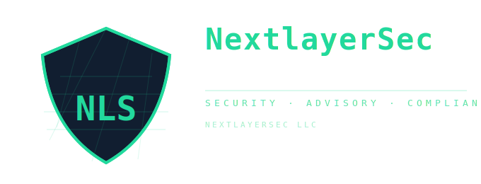

  

<h1 align="center">Matthew Levorson</h1>

  <i>Security Engineer • Security Operations • Blue Team</i> 
  <i>Endpoint • Identity • Microsoft Security Stack</i>

  <i>ISC2 CC | CompTIA A+ | Network+ | Security+ | Linux+</i> 
   <i>CySA+ • SSCP • PenTest+ (in progress)</i> 

---

### 🔗 Professional Links

  
  

---

## 🧭 Professional Summary

I am a security engineer focused on **defensive security operations**, endpoint and
identity protection, and incident response within Microsoft-centric environments.

My work emphasizes:
- Practical detection and investigation fundamentals
- Governance, procedures, and repeatability
- Security operations in real business environments
- Clear documentation that supports auditability, handoff, and scale

I prioritize **how security is actually operated** over tool sprawl or theoretical controls.

---

## 🛡️ Primary Work — Operations Guide

**Operations Guide** is my primary body of work and represents how I approach
security engineering in practice.

It is a governed security operations framework that consolidates:

- Endpoint investigation and triage workflows
- Ransomware, malware, and BEC response procedures
- Windows, Linux, macOS, and Exchange command references
- Security hardening baselines
- Threat behavior education (beaconing, persistence, lateral movement)
- Framework-aligned governance (NIST CSF, CIS Controls, MITRE ATT&CK)
- Structured incident documentation
- Safe, gated automation guidance

The repository is intentionally designed to resemble **internal security operations
documentation** used by professional teams and serves as a single source of truth
for how security work is performed.

---

## ⚙️ Tools & Platforms

  
  
  
  
  

  
  
  
  

  
  
  

---

## 📊 GitHub Activity

  
   
  

---

## 🔮 Current Focus

- Operations Guide (security operations framework)
- Microsoft Defender detection and investigation
- Endpoint and identity hardening
- Incident response documentation and automation
- Continuous blue team skill development

---

  <b>Matthew Levorson</b> • <a href="https://nextlayersec.io">nextlayersec.io</a>

