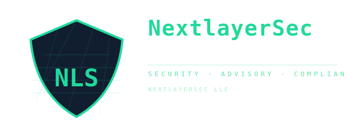

  

<h2 align="center">Matthew Levorson</h2>

  <i>Security Engineer &mdash; Blue Team &middot; Email Security &middot; Microsoft 365 Hardening</i>

  <a href="https://nextlayersec.io">nextlayersec.io</a>
  &nbsp;&middot;&nbsp;
  <a href="https://linkedin.com/in/matthewlevorson">LinkedIn</a>

 

### About

Independent security consultant. Email authentication, identity hardening, and
Microsoft 365 defense for small and mid-market organizations. Production-validated
controls aligned to NIST SP 800-53 and CIS Controls v8.

### Selected Work

<table>
<tr>
<td valign="top" width="50%">

**[M365 Assessment Framework](https://github.com/Blackvectra/NRG-Assessment-Tool)**

Multi-tenant security assessment producing client-ready reports mapped to NIST and CIS.

</td>
<td valign="top" width="50%">

**[Email Security Framework](https://github.com/Blackvectra/nextlayersec-email-security)**

End-to-end SPF, DKIM, DMARC, MTA-STS, and DNSSEC deployment for Microsoft 365 tenants.

</td>
</tr>
<tr>
<td valign="top" width="50%">

**[NextLayerSec Assessment](https://github.com/Blackvectra/NLS-Assessment)**

Microsoft 365 assessment toolkit built for independent consulting engagements.

</td>
<td valign="top" width="50%">

**[Blue Team Playbooks](https://github.com/Blackvectra/nextlayersec-guides)**

Detection workflows, threat intelligence documentation, purple team lab guidance.

</td>
</tr>
</table>

### Principles

- Assume compromise; design for survivability.
- Production-validated controls over lab posture.
- Documentation is part of the control.

### Frameworks

NIST CSF 2.0 &middot; NIST SP 800-53 &middot; MITRE ATT&amp;CK &middot; CIS Controls v8 &middot; ISO/IEC 27001 &middot; RFC 8461 &middot; RFC 7489
